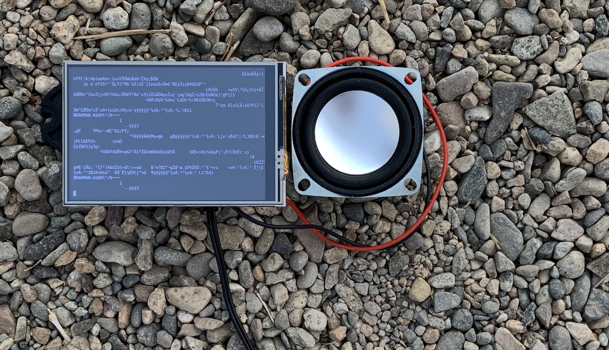
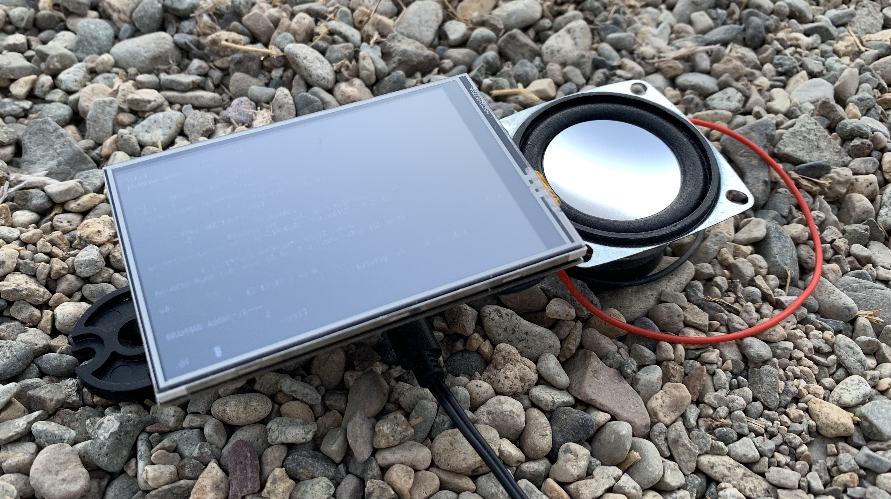
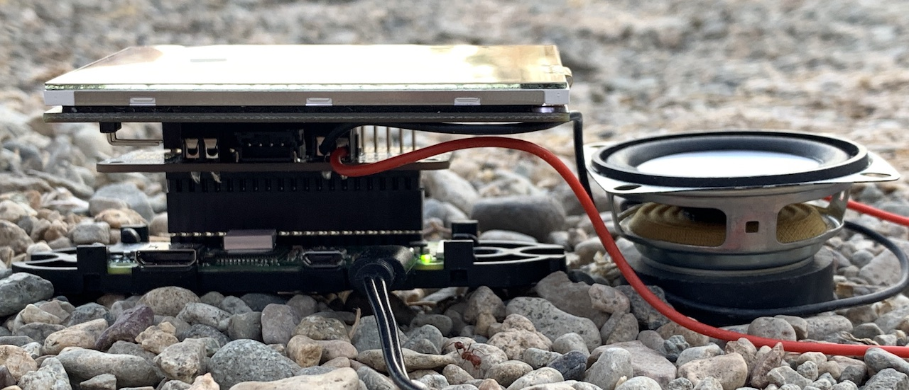

# TinyDragon0

*by Phillip David Stearns 2020*

A box that captures broadcast wifi traffic, prints it to an onboard screen and converts the raw packet data to sound.

It's a very scaled down and simplified version of the installation [Here Be Dragons](https://phillipstearns.com/artwork#/here-be-dragons/), that translated cyber attacks on honeypot servers setup around the globe into sound.

This box is a way for us humans to sense the invisible wireless signals that make up our local networked digital ecosystem by bringing it into our field of perception. It's meant to be experienced much like the roar of the ocean, as something to become familiar with, a texture that is at first incomprehensible, but after some time, we can begin to intuit meaning and significance from its ebbs and flows.

## Prototype







### Notes:

* [Project BOM](https://docs.google.com/spreadsheets/d/1Ew9h2tyMmVrVZR29q5cJ_7pIAUenJ0zchHGKwL7NTBA/edit?usp=sharing)

The electronics are to be installed within a ready-made bookshelf speaker. Currently looking at ~\$125 for all parts. Eyeing a target retail price of 250 each. Edition of 50.

**Working in prototype:**

* Raspberry Pi can sniff wifi traffic
* Traffic can be displayed as text on a 3.5" LCD screen
* Traffic is audible via 3W amplifier
* Whole system starts up automatically when power is applied

**To Do:**

* Knob for controlling volume (possibly doubles as push on/off for the whole box
* Knob for manually "tuning" the WiFi channel being sniffed. Push button switches between tuning and scanning modes
* Case mod for shelf speaker for seamless integration.
	* Route top
	* Plexi cover (optional?)
	* port for power
	* on off switch

## Installation

* [Installing Kali Linux on a Pi Zero W](https://dantheiotman.com/2017/10/06/installing-kali-linux-on-a-pi-zero-w/)
* [Set Up Kali Linux on the New $10 Raspberry Pi Zero W ](https://null-byte.wonderhowto.com/how-to/set-up-kali-linux-new-10-raspberry-pi-zero-w-0176819/)
* [Enable Monitor Mode & Packet Injection on the Raspberry Pi](https://null-byte.wonderhowto.com/how-to/enable-monitor-mode-packet-injection-raspberry-pi-0189378/)
* [Raspberry Pi Zero W WiFi Hacking Gadget](https://medium.com/@THESMASHY/raspberry-pi-zero-w-wifi-hacking-gadget-63e3fa1c3c8d)

### Hardware:

#### Parts:

* Raspberry Pi Zero W (CanaKit)
* USB hub (minimum 2x ports)
* Kuman 3.5" TFT touch display
* 1/8" sereo jack with switch
* 2.5" 4ohm 3W speaker
* Adafruit Audio Bonnet

#### Setup Raspberry Pi Zero:

1. Download and flash the "Raspberry Pi OS (32-bit) Lite" image from [Raspberry Pi OS](https://www.raspberrypi.org/downloads/raspberry-pi-os/) onto a micro SD card using [balenaEtcher](https://www.balena.io/etcher/).
1. Remove and reinsert card to remount.
1. Open a terminal and `cd` to the `/boot/` volume.
1. add a file `ssh`
1. create a `wpa_supplicant.conf` file and populate it with:

```
country=US
ctrl_interface=DIR=/var/run/wpa_supplicant GROUP=netdev
update_config=1

network={
ssid="WIFI_SSID"
scan_ssid=1
psk="WIFI_PASSWORD"
key_mgmt=WPA-PSK
}
```

1. Unmount card, insert into Pi Zero, power up and connect to your host machine via USB.
1. ping `raspberrypi.local`
1. if successful, login: `ssh pi@raspberrypi.local`
1. create user `tinydragon`: `sudo useradd tinydragon -m`
1. create group `tinydragon and wheel`: `sudo groupadd tinydragon wheel`
1. add `tinydragon` to groups: `sudo usermod -a -G wheel,tindydragon`
1. Run `sudo visudo` and modify:

```
%sudo   ALL = (ALL) NOPASSWD: ALL
%wheel  ALL=(ALL:ALL) ALL
```

1. Set password for `tinydragon`: `sudo passwd tinydragon`
1. Run `sudo nano /etc/hostname` and replace `raspberrypi` with `tinydragon0`
1. Run `sudo nano /etc/hosts` and replace `raspberrypi` with `tinydragon0`
1. reboot: `sudo reboot -h now`
1. login in using `ssh tinydragon@tinydragon0.local`
1. remove to user `pi`: `sudo userdel -r pi`
1. permanently boot to console: `sudo systemctl set-default multi-user.target`, `graphical.target` for GUI
1. `sudo apt-get update && sudo apt-get upgrade -y`
1. `wget -O re4son-kernel_current.tar.xz https://re4son-kernel.com/download/re4son-kernel-current/ && tar -xJf re4son-kernel_current.tar.xz`
1. `cd re4son-kernel_*`
1. `sudo ./install.sh`, Y to all
1. log back in and run: `iw phy phy0 info`

```
...
Supported interface modes:
		 * IBSS
		 * managed
		 * AP
		 * monitor
		 * P2P-client
		 * P2P-GO
		 * P2P-device
...
``` 

1. `sudo apt-get update && sudo apt-get install git tcpdump aircrack-ng python3-pyaudio -y`

#### Kuman MHS35 Display

1. `git clone https://github.com/goodtft/LCD-show.git`
1. `chmod -R 755 LCD-show`
1. `cd LCD-show/`
1. `sudo ./MHS35-show`
1. wait for the pi to reboot
1. `sudo apt-get --fix-broken install`
1. `sudo apt-get update && sudo apt-get update -y && sudo apt-get install xinit`

#### Setting up the Adafruit Audio Bonnet

1. Solder terminals to bonnet
1. Solder wires to speaker
1. Solder wires to left and right non-switched side of 1/8" jack
1. Solder speaker wires to left channel on switched side of 1/8" jack
1. Secure left and right jack wires into respective terminal blocks on bonnet

Note: I setup the audio bonnet first, then the display. The display installation scripts overwrite /boot/cmdline.txt and /boot/config.txt files. This kinds messes up the audio bonnet setup, requiring manual modification of files (documented in their installation instructions). It's possible that Adafruit's installation script will overwrite files necessary for the Kuman display to work.

Some work has to be done to either figure out the ideal setup order to use the installation scripts in a way that they don't interfere or to manually customize the installations for both. At present, it seems that to ansible-ize this for bootstrap and setup on unconfigured devices, installation scripts could be run in any order and the final version of files in /boot/ from a completely setup pi could be copied onto the device as a final step.

#### Enabling Gadget mode (Ethernet over USB)

1. `cd /boot`
1. edit `config.txt` to enable gadget mode overlay by adding a new line: `dtoverlay=dwc2` above `[pi4]`.
1. edit `cmdline.txt` to include `modules-load=dwc2,g_ether` after `rootwait`

#### Disabling WiFi

Temporarily:

1. `sudo systemctl stop wpa_supplicant`
1. `airmon-ng start wlan0`

Permanently:

1. `sudo systemctl disable wpa_supplicant`
1. add `airmon-ng start wlan0` to `/etc/rc.local` before `exit 0`

#### Restoring WiFi Internet Connection

Temporarily:

1. Bring down the monitor interface: `sudo airmon-ng stop wlan0mon`
1. Restart WiFi networking services: `sudo systemctl restart wpa_supplicant.service networking.service`
1. Bring up the WiFi interface: `sudo ip link set wlan0 up` and wait a minute
1. Check IP assignment: `ifconfig wlan0`
1. Test internet connection: `ping google.com -c 3`
1. Do your downloading. On reboot, everything will be returned to "normal".

Permanently:

1. Same as above, but enable WiFi wpa_supplicant.service: `sudo systemctl enable wpa_supplicant.service`

#### TinyDragon0 Software

1. Clone the repo: `git clone https://github.com/phillipdavidstearns/tinydragon0.git`
1. `cd tinydragon0`
1. `sudo cp tinydragon0.service /lib/systemd/system/`
1. `sudo systemctl enable tinydragon0.service`
1. `sudo systemctl start tinydragon0.service`  

## `tinydragon0.py` Usage

Simple, but it must be run as root (with `sudo`):

```
usage: tinydragon0 [-h] [-a] [-s] -i INTERFACE [-c CHUNK_SIZE]
                    [-r SAMPLE_RATE] [-w WIDTH] [-t TIMEOUT] [-p]

optional arguments:
  -h, --help            show this help message and exit
  -a, --audio-blocking  non-blocking by default
  -s, --socket-blocking
                        non-blocking by default
  -i INTERFACE, --interface INTERFACE
                        [if0[,if1]]
  -c CHUNK_SIZE, --chunk-size CHUNK_SIZE
                        chunk size in frames
  -r SAMPLE_RATE, --sample-rate SAMPLE_RATE
                        frames per second
  -w WIDTH, --width WIDTH
                        bytes per sample
  -t TIMEOUT, --timeout TIMEOUT
                        socket timeout in seconds
  -p, --print-packet    print packet to console
```

### Examples:

Listen to WiFi traffic: 

```
sudo tinydragon0 -i wlan0
```

Listen on more than one interface: 

```
sudo tinydragon0 -i wlan0,eth0
```

Enable blocking with `-a` for audio and `-s` for socket (recommended to use audio blocking and socket non-blocking):

```
sudo tinydragon0 -i wlan0,eth0 -a -s
```

Print the data written to the audio buffer with `-p` (hint: doesn't make sense to use without a monitor):

```
sudo tinydragon0 -i wlan0 -p
```

## Credits

Code cobbled together from examples at:

* [How to Write a Simple Packet Sniffer](http://www.bitforestinfo.com/2017/01/how-to-write-simple-packet-sniffer.html)
* [Wire Callback Examples](https://people.csail.mit.edu/hubert/pyaudio/#wire-callback-example)
* [Capturing SIGINT in Python](https://stackoverflow.com/questions/1112343/how-do-i-capture-sigint-in-python#1112350)

A nice link illuminating protocol codes in linux:

* [Linux Protocol Codes](https://github.com/torvalds/linux/blob/ead751507de86d90fa250431e9990a8b881f713c/include/uapi/linux/if_ether.h)
